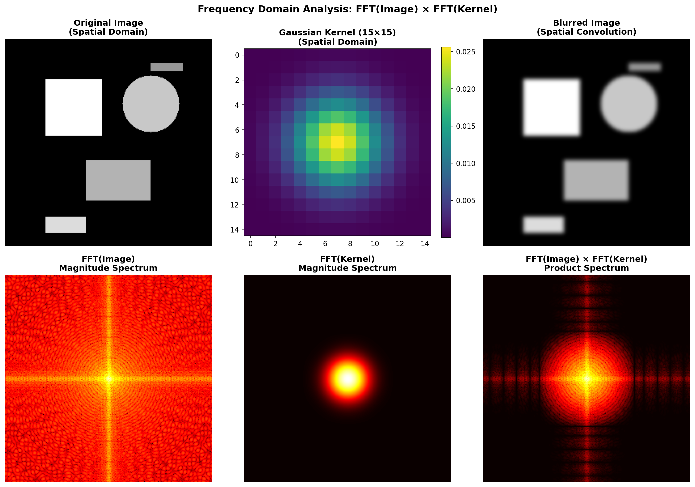
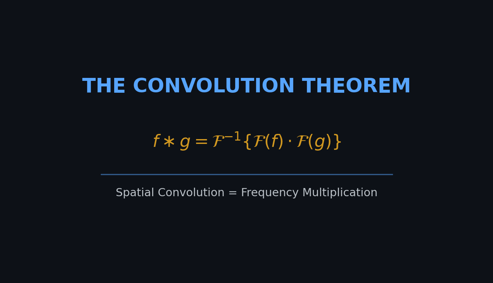

# Convolution Theorem Proof

## CSc 8830 Module 3: Convolution Theorem

<p align="center">
  
</p>

## Overview

This project demonstrates that **convolution in the spatial domain is equivalent to multiplication in the frequency domain** — the fundamental Convolution Theorem.

<p align="center">
  
</p>

## 🎯 Objective

Prove that **convolution in the spatial domain equals multiplication in the frequency domain**:

$$
f \ast g = \mathcal{F}^{-1}\{\mathcal{F}(f) \cdot \mathcal{F}(g)\}
$$

We verify this by:
1. Blurring an image using direct spatial convolution
2. Blurring the same image using FFT multiplication
3. Comparing the results (MSE ≈ 0)

## ✅ Results

**MSE between spatial and frequency methods: 1.04 × 10⁻²⁶** (machine precision)

The two approaches produce identical results, verifying the theorem.

| Metric | Value |
|--------|-------|
| **MSE** | `1.04 × 10⁻²⁶` |
| **Max Difference** | `0.000000` |
| **PSNR** | `307.96 dB` |
| **Verdict** | ✓ **THEOREM VERIFIED** |

## 🚀 Quick Start

```bash
pip install -r requirements.txt
python image_blurring_demo.py --kernel_size 15
```

## 📁 Files

```
├── image_blurring_demo.py    # Main implementation
├── report.tex                # LaTeX report
├── requirements.txt          # Dependencies
└── output/
    ├── convolution_theorem_demo.gif
    ├── convolution_theorem_proof_k15.png
    └── frequency_analysis_k15.png
```

## 📐 The Math

**Spatial Domain:**
```
Output = Image ⊗ Kernel
```

**Frequency Domain:**
```
Output = IFFT(FFT(Image) × FFT(Kernel))
```

Both methods produce **identical results** (within machine precision).

---

*CSc 8830 Computer Vision | February 2026*