# CSc 8830: Computer Vision — Module 4 Assignment

## Thermal Animal Boundary Segmentation: Traditional CV vs. SAM2

**Author:** Adele Chinda  
**Date:** February 2026  
**Course:** CSc 8830 — Computer Vision  
**Repository:** [github.com/arrdel/computer-vision](https://github.com/arrdel/computer-vision)

---

## Overview

This project implements a **traditional computer vision pipeline** for detecting animal boundaries in thermal (infrared) camera images using **only classical OpenCV techniques** — no deep learning or machine learning. Results are then compared quantitatively against **Meta's SAM2** (Segment Anything Model 2) to evaluate the strengths and limitations of each approach.

### Input Thermal Images

| Sample 1 | Sample 2 |
|:---:|:---:|
| 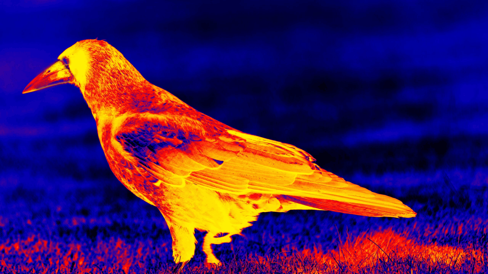 | 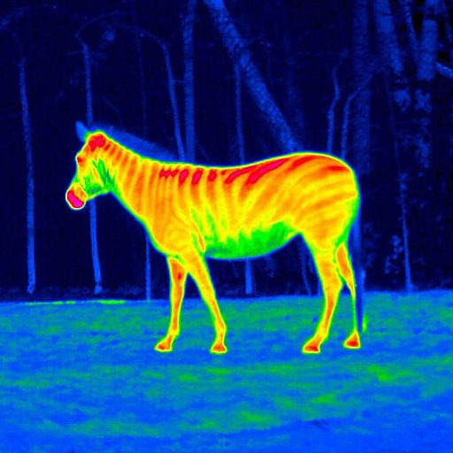 |

---

## Results at a Glance

### Traditional CV Pipeline

The classical pipeline processes each thermal image through 5 stages: CLAHE enhancement → multi-strategy thresholding → Canny edge refinement → morphological operations → contour-based boundary extraction.

| Sample 1 — CV Pipeline | Sample 2 — CV Pipeline |
|:---:|:---:|
| 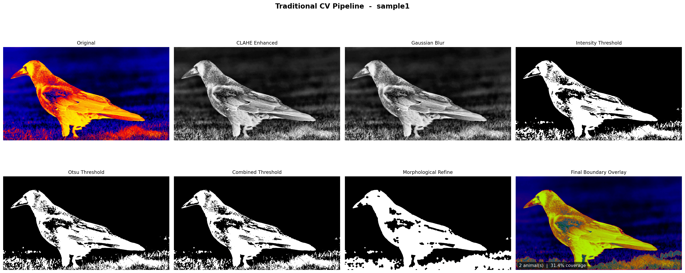 | 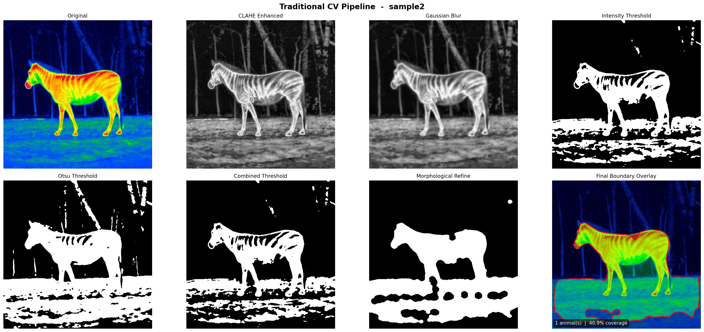 |

### SAM2 Segmentation

SAM2 generates multiple mask proposals per image. We filter them by area (1%–60% of image) to isolate animal-sized regions.

| Sample 1 — SAM2 Masks | Sample 2 — SAM2 Masks |
|:---:|:---:|
| 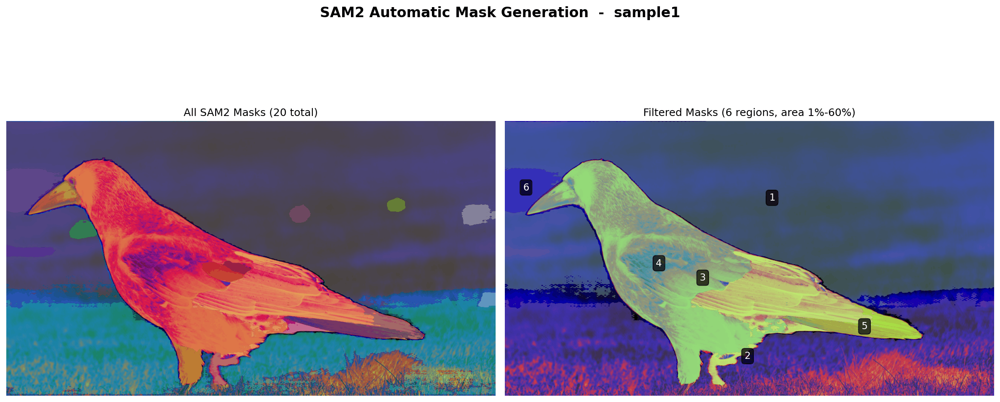 | 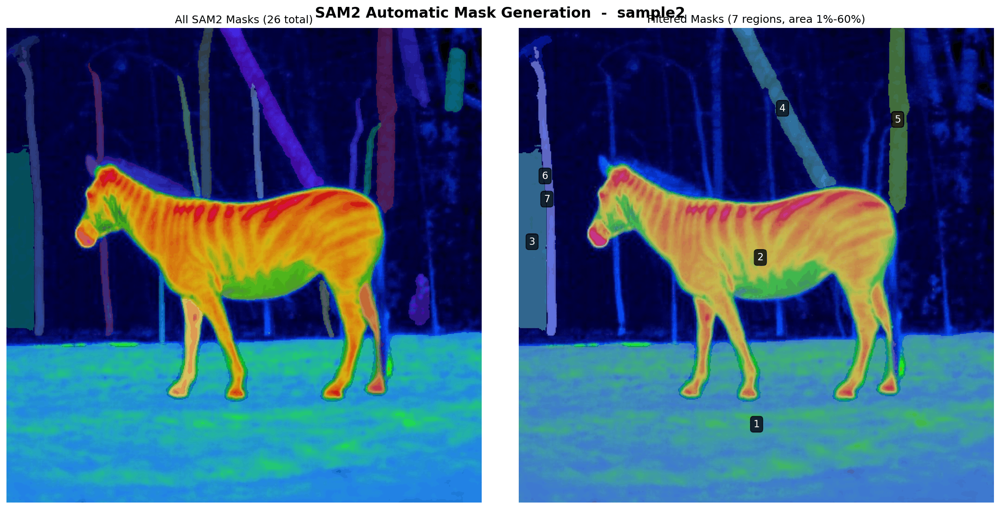 |

### Side-by-Side Comparison

Full comparison panels showing overlays, masks, overlap maps, contour comparisons, and metrics:

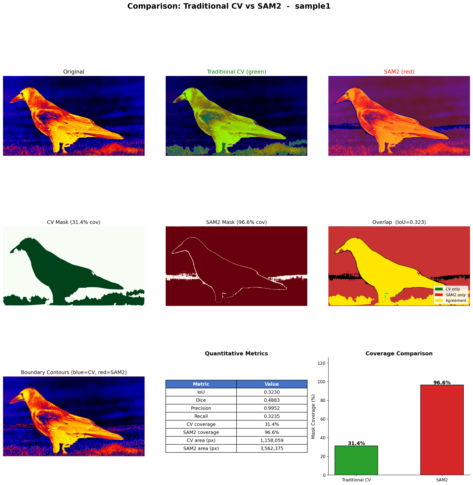

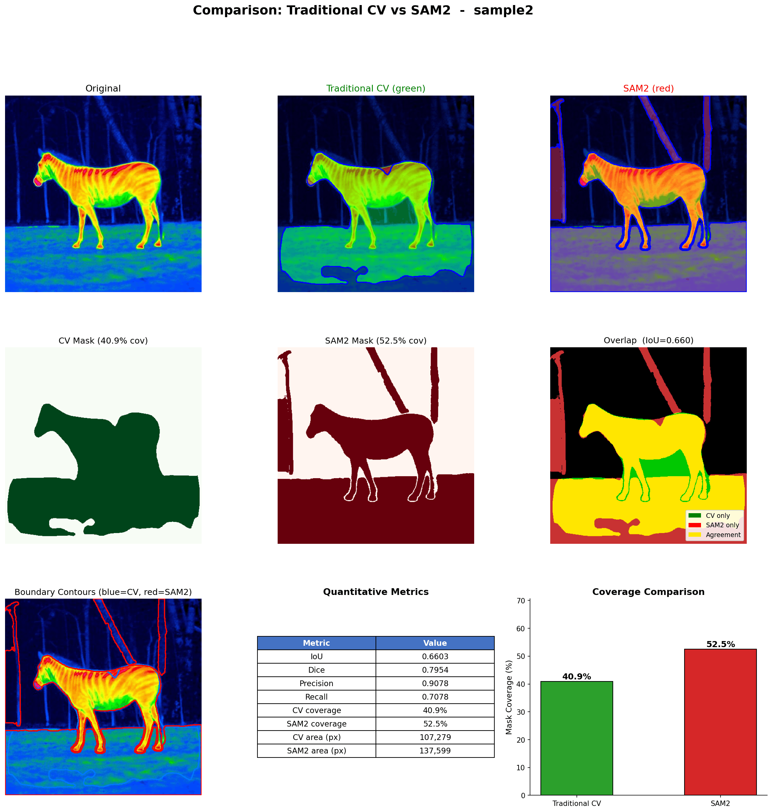

### Summary

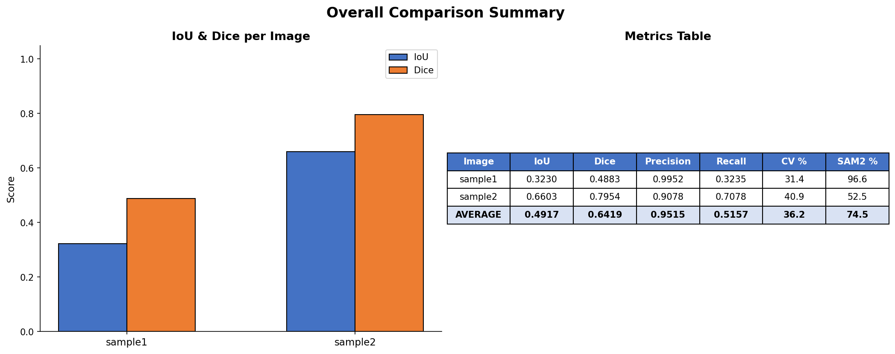

---

## Quantitative Results

| Image | IoU | Dice | Precision | Recall | CV Coverage | SAM2 Coverage | 
|-------|-----|------|-----------|--------|-------------|---------------|
| sample1 | 0.3230 | 0.4883 | 0.9952 | 0.3235 | 31.4% | 96.6% | 
| sample2 | 0.6603 | 0.7954 | 0.9078 | 0.7078 | 40.9% | 52.5% | 
| **Average** | **0.4917** | **0.6419** | **0.9515** | **0.5157** | **36.2%** | **74.5%** | 

**Key findings:**
- **Precision ≈ 95%** — the traditional CV pipeline is highly precise; almost all pixels it flags are real foreground
- **CV is ~20× faster** than SAM2 (no GPU needed)
- **SAM2 has higher recall** — it captures more of the animal (including cooler extremities) but also over-segments
- The two methods are **complementary**: CV excels at precise thermal core detection, SAM2 at comprehensive coverage

---

## Project Structure

```
CSc8830_Module4_Assignment/
├── README.md                      # This file
├── report.tex                     # LaTeX report with full analysis
├── thermal_segmentation.py        # Traditional CV segmentation pipeline
├── sam2_comparison.py             # SAM2-only comparison script  
├── run_full_comparison.py         # Full pipeline: CV + SAM2 + visualizations
├── download_samples.py            # Generate/download test thermal images
├── images/                        # Input thermal images
│   ├── sample1.png                #   2560×1441 thermal image
│   └── sample2.png                #   512×512 thermal image
├── results/                       # Traditional CV outputs
│   ├── sample*_pipeline.png       #   Full pipeline visualizations
│   ├── sample*_boundary.png       #   Boundary overlays
│   ├── sample*_boundary_detail.png#   Refinement detail
│   └── sample*_mask.png           #   Binary masks
├── comparison_results/            # Full comparison outputs
│   ├── 00_summary.png             #   Cross-image summary
│   ├── sample*_01_cv_pipeline.png #   CV pipeline per image
│   ├── sample*_02_sam2_masks.png  #   SAM2 masks per image
│   ├── sample*_03_comparison.png  #   Full comparison panels
│   ├── sample*_cv_mask.png        #   CV binary masks
│   └── sample*_sam2_mask.png      #   SAM2 binary masks
├── sam2_results/                   # SAM2-only outputs
└── checkpoints/                    # SAM2 model weights
    └── sam2.1_hiera_small.pt      #   176 MB checkpoint
```

---

## Method: Traditional CV Pipeline

The segmentation pipeline consists of **5 stages**, all implemented with OpenCV:

### Step 1 — Preprocessing
- **Grayscale conversion** → `cv2.cvtColor(BGR2GRAY)`
- **CLAHE** (Contrast Limited Adaptive Histogram Equalization) — enhances local contrast in thermal images with limited dynamic range (`clipLimit=3.0`, `tileGridSize=(8,8)`)
- **Gaussian blur** (7×7) — reduces sensor noise while preserving edges

### Step 2 — Multi-Strategy Thresholding
Three thresholding methods are combined for robustness:
- **Otsu's thresholding** — automatic global threshold (maximizes inter-class variance)
- **Adaptive thresholding** — Gaussian-weighted local thresholding for uneven illumination
- **Intensity-based thresholding** — isolates thermal hot-spots using `T = μ + 1.0σ`

Combined as: **Otsu AND Intensity** (strict intersection keeps only warmest regions)

### Step 2b — Canny Edge Refinement
- Canny edge detection (thresholds 30, 100) captures sharp thermal gradients
- Edge map dilated and combined with threshold mask to reinforce boundaries

### Step 3 — Morphological Refinement
Using **elliptical** structuring elements (preserves organic animal shapes):
1. **Closing** (11×11, 2 iter) — fill internal holes
2. **Opening** (5×5, 3 iter) — remove noise blobs
3. **Final closing** (5×5, 1 iter) — cleanup

### Step 4 — Contour Detection & Filtering
- External contour detection (`RETR_EXTERNAL`)
- **Area filtering**: min = max(500, 1% of image), max = 50% of image
- **Bounding box rejection**: reject if >95% of image width AND height
- **Edge-touching rejection**: reject contours touching ≥3 image edges (background)

### Step 5 — Boundary Refinement
- **Douglas–Peucker approximation** (ε = 0.005 × perimeter) for clean edges
- **Convex hull** for overall shape
- **Coordinate smoothing** via uniform 1-D filtering for natural boundaries

| Sample 1 Boundary | Sample 2 Boundary |
|:---:|:---:|
| 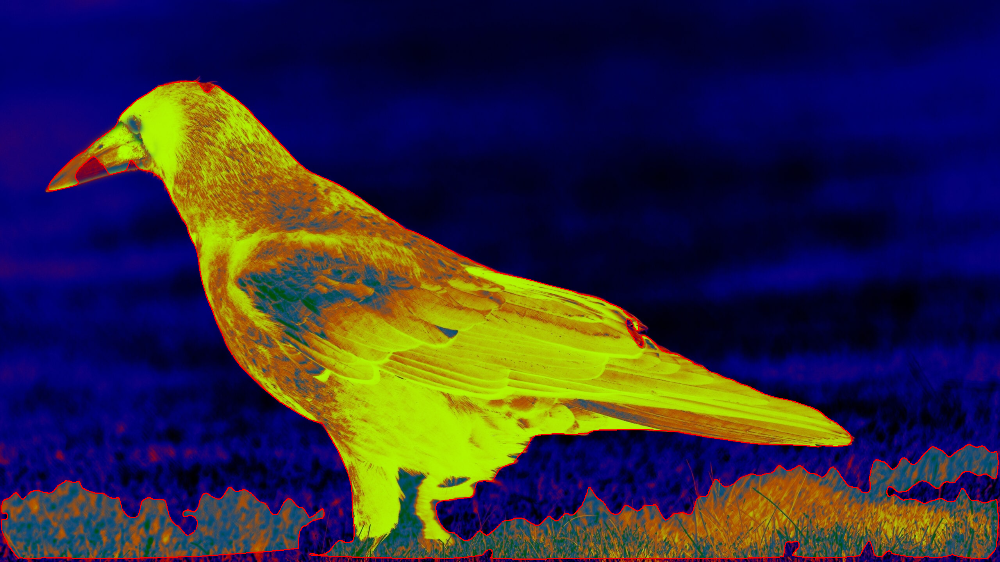 | 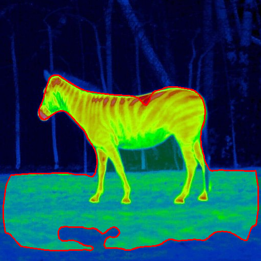 |

---

## SAM2 Configuration

- **Model**: `sam2.1_hiera_small` (176 MB checkpoint)
- **Generator**: `SAM2AutomaticMaskGenerator` with `points_per_side=32`, `pred_iou_thresh=0.7`, `stability_score_thresh=0.8`
- **Post-filtering**: Keep masks with area between 1%–60% of image (removes tiny noise and full-image background masks)

---

## Requirements

```bash
# Core (traditional CV)
pip install opencv-python numpy matplotlib scipy

# SAM2 comparison
pip install sam2 torch torchvision
```

**SAM2 Checkpoint** (auto-downloaded or manually):
```bash
mkdir -p checkpoints
wget -P checkpoints/ https://dl.fbaipublicfiles.com/segment_anything_2/092824/sam2.1_hiera_small.pt
```

---

## How to Run

### Quick Start — Full Comparison (Recommended)

```bash
# Runs both CV and SAM2 on all images, generates all visualizations
python run_full_comparison.py
```

This produces everything in `comparison_results/`: per-image pipeline figures, SAM2 masks, side-by-side comparisons, and the summary figure.

### Traditional CV Only

```bash
# Process all images
python thermal_segmentation.py --image_dir images/

# Single image with custom parameters
python thermal_segmentation.py --image images/sample1.png \
    --blur_kernel 9 --morph_kernel 7 --min_area 1000
```

### SAM2 Comparison Only

```bash
python sam2_comparison.py --image_dir images/
```

---

## Tunable Parameters

| Parameter | Default | Description |
|-----------|---------|-------------|
| `--blur_kernel` | 7 | Gaussian blur kernel size (odd number) |
| `--morph_kernel` | 5 | Morphological operation kernel size |
| `--min_area` | 500 | Minimum contour area (pixels) |
| `--adaptive_block` | 51 | Block size for adaptive thresholding |
| `--adaptive_c` | 8 | Constant for adaptive thresholding |
| `--output_dir` | `results/` | Output directory |

---

## Report

A full LaTeX report is available at [`report.tex`](report.tex) with:
- Detailed method description with equations
- All pipeline visualizations
- Quantitative metrics tables
- Discussion of strengths, limitations, and key takeaways
- References to foundational papers (Otsu, Canny, CLAHE, Douglas–Peucker, SAM/SAM2)

---

## Key Design Decisions

1. **CLAHE over standard histogram equalization** — better preserves local contrast in thermal images with limited dynamic range
2. **Multi-strategy thresholding** — a single method fails on thermal images with varying background temperatures; combining Otsu and intensity provides robustness
3. **Elliptical morphological kernels** — animal shapes are generally organic/round, so elliptical kernels preserve boundaries better than rectangular ones
4. **Dynamic minimum area** — scales with image resolution (`max(500, 1% of image)`) to handle different input sizes
5. **Edge-touching contour rejection** — removes full-frame background regions that survive thresholding

---

