# CSc 8830 — Module 7: Optical Flow, Motion Tracking & Structure from Motion

## Overview

This assignment implements:

1. **Optical Flow & Motion Tracking** — Dense (Farnebäck) and sparse (Lucas-Kanade) optical flow on two 30-second video clips, with motion analysis, bilinear interpolation demonstration, and tracking validation.
2. **Structure from Motion (SfM)** — 3D reconstruction from 4 viewpoints of a planar object, including feature matching, pose estimation, triangulation, and boundary estimation.

---

## Directory Structure

```
CSc8830_Module7_Assignment/
├── optical_flow.py              # Part 1: Optical flow & tracking
├── structure_from_motion.py     # Part 2: Structure from Motion
├── download_videos.py           # Helper: download & trim YouTube videos
├── run_all.py                   # Master script to run everything
├── report.tex                   # LaTeX report with derivations
├── requirements.txt             # Python dependencies
├── README.md                    # This file
├── videos/                      # Input videos (after download)
│   ├── video1.mp4
│   └── video2.mp4
├── sfm_images/                  # 4 photos of a planar object
│   ├── view0.jpg
│   ├── view1.jpg
│   ├── view2.jpg
│   └── view3.jpg
└── output/
    ├── optical_flow/            # Flow visualisations, tracking results
    └── sfm/                     # 3D reconstruction, camera poses
```

---

## Setup

```bash
# Create virtual environment
python -m venv venv
source venv/bin/activate

# Install dependencies
pip install -r requirements.txt

# (Optional) Install yt-dlp and ffmpeg for video download
pip install yt-dlp
sudo apt install ffmpeg   # or brew install ffmpeg on macOS
```

---

## Step 1: Get Videos

### Option A — Download from YouTube

```bash
python download_videos.py \
  --url1 "YOUTUBE_URL_1" \
  --url2 "YOUTUBE_URL_2" \
  --start1 "0:10" --start2 "0:05" --duration 30
```

### Option B — Use your own videos

Place two `.mp4` files (at least 30 seconds each with motion) in the `videos/` directory.

### Recommended YouTube Videos

| Video | Type of Motion | What to Search |
|-------|---------------|----------------|
| **Video 1** | Translational / lateral | `"dashcam highway traffic 4K"` or `"soccer match broadcast wide angle"` |
| **Video 2** | Rotational / complex | `"FPV drone flight city"` or `"figure skating performance"` |

**Good characteristics for optical flow analysis:**
- Steady frame rate (30 fps)
- Continuous motion throughout the 30s clip
- Mix of foreground and background motion
- Good lighting and texture

---

## Step 2: Get SfM Images

Take **4 photos** of a flat/planar object (book cover, poster, painting, etc.) from different angles:

1. **Front view** — directly facing the object
2. **Left view** — ~30° from the left
3. **Right view** — ~30° from the right  
4. **Angled view** — from above-left or above-right (~45°)

**Tips:**
- Keep the object stationary
- Maintain consistent lighting
- Ensure >50% overlap between views
- Note your approximate camera position for each shot

Save images as `sfm_images/view0.jpg`, `sfm_images/view1.jpg`, etc.

---

## Step 3: Run the Pipeline

### Run everything at once

```bash
python run_all.py \
  --video1 videos/video1.mp4 \
  --video2 videos/video2.mp4 \
  --sfm_images sfm_images/
```

### Or run parts individually

```bash
# Part 1: Optical Flow
python optical_flow.py --video1 videos/video1.mp4 --video2 videos/video2.mp4

# Part 2: Structure from Motion
python structure_from_motion.py --images sfm_images/
```

---

## Results

### Part 1 — Optical Flow & Motion Tracking

#### Flow Analysis (magnitude, direction, motion mask, divergence, curl)

<p align="center">
  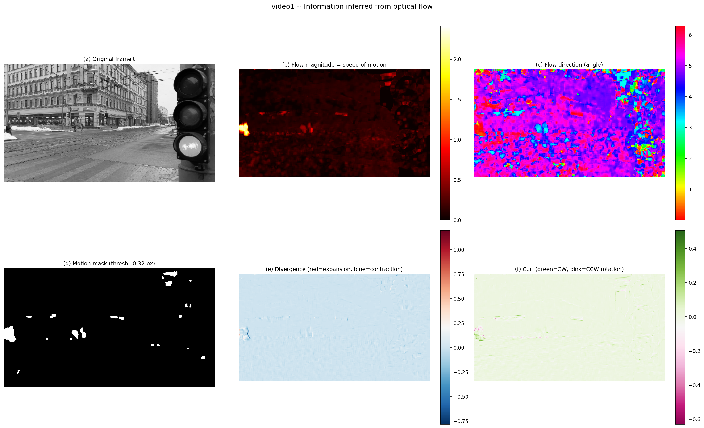
</p>
<p align="center"><em>Video 1 — Dense optical flow analysis: magnitude, direction, motion mask, divergence, and curl fields.</em></p>

<p align="center">
  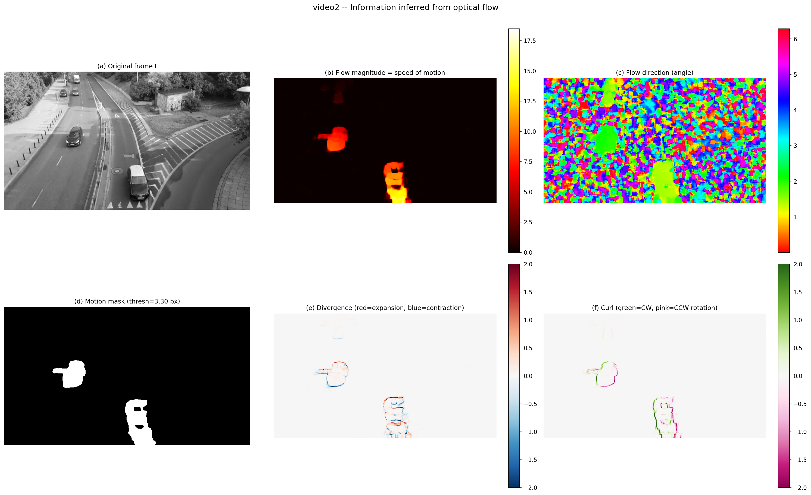
</p>
<p align="center"><em>Video 2 — Dense optical flow analysis. Higher magnitudes and visible divergence indicate approaching objects.</em></p>

#### Moving Object Detection

<p align="center">
  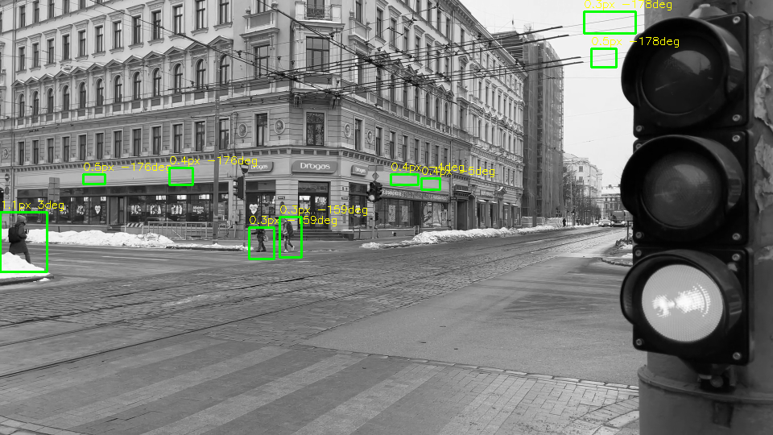
  &nbsp;&nbsp;
  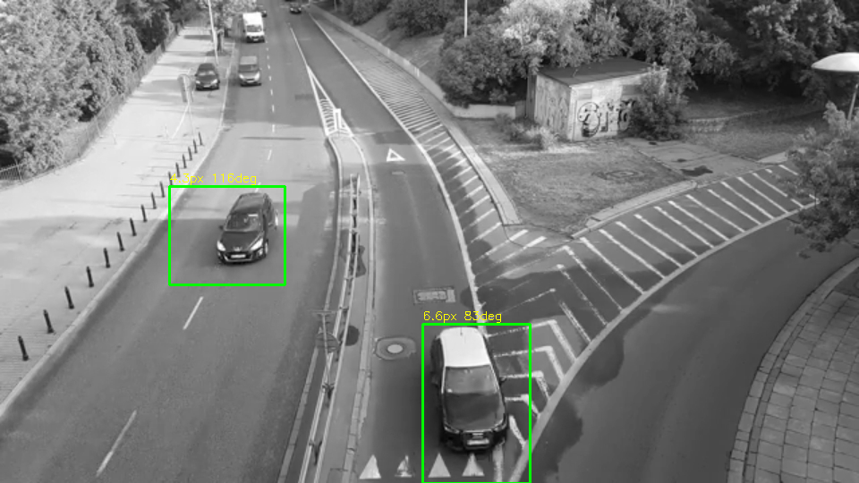
</p>
<p align="center"><em>Foreground/background segmentation via flow magnitude thresholding with bounding box detection.</em></p>

#### Tracking Validation (Manual LK vs OpenCV LK vs Template Matching)

<p align="center">
  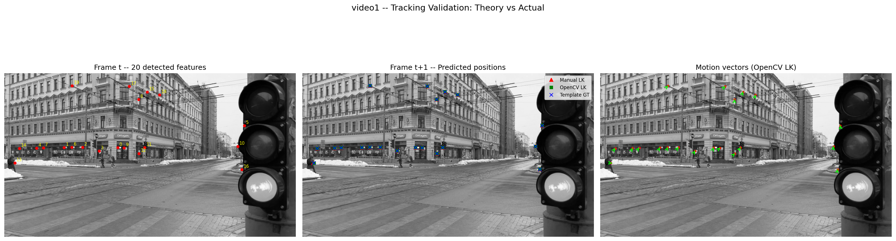
</p>
<p align="center"><em>Video 1 — Tracking validation: 20 feature points tracked by manual single-scale LK, OpenCV pyramidal LK, and template matching ground truth. Mean error &lt; 0.4 px.</em></p>

<p align="center">
  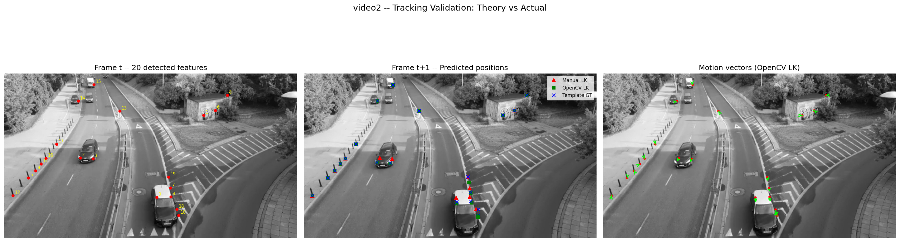
</p>
<p align="center"><em>Video 2 — Tracking validation with larger displacements. Pyramidal LK outperforms single-scale LK for fast motion.</em></p>

#### Bilinear Interpolation Demonstration

<p align="center">
  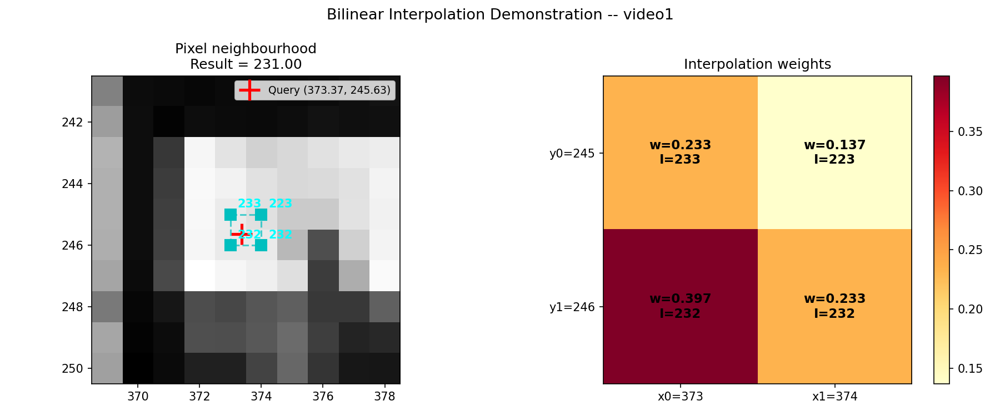
</p>
<p align="center"><em>Step-by-step bilinear interpolation at a sub-pixel location with weight visualisation.</em></p>

---

### Part 2 — Structure from Motion

#### Input Views (4 viewpoints)

<p align="center">
  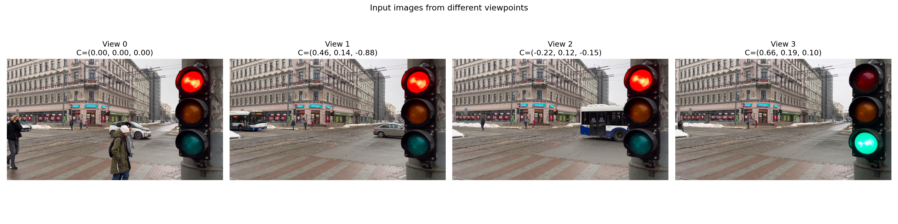
</p>
<p align="center"><em>Four frames extracted from the video, used as different viewpoints for 3D reconstruction.</em></p>

#### SIFT Feature Matching

<p align="center">
  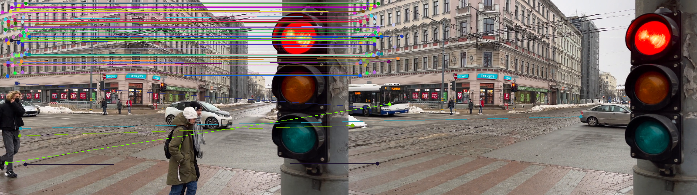
  &nbsp;&nbsp;
  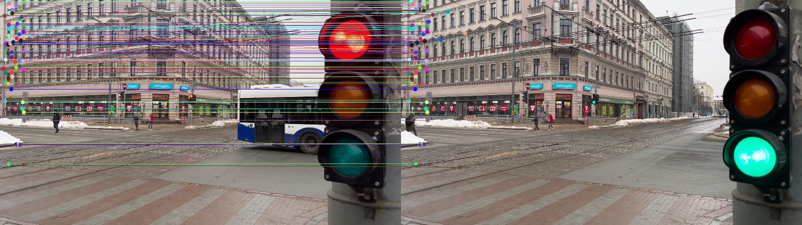
</p>
<p align="center"><em>SIFT feature matches between view pairs (Lowe's ratio test, τ = 0.75). Left: views 0 ↔ 1. Right: views 2 ↔ 3.</em></p>

#### 3D Reconstruction

<p align="center">
  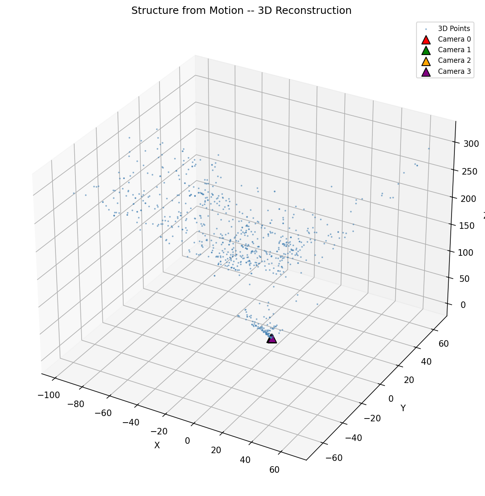
  &nbsp;
  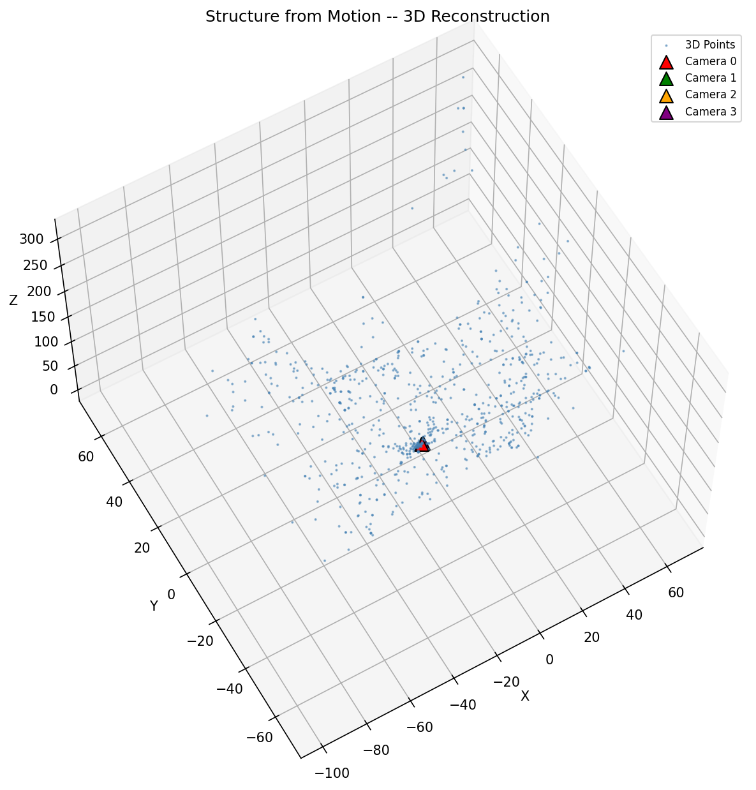
  &nbsp;
  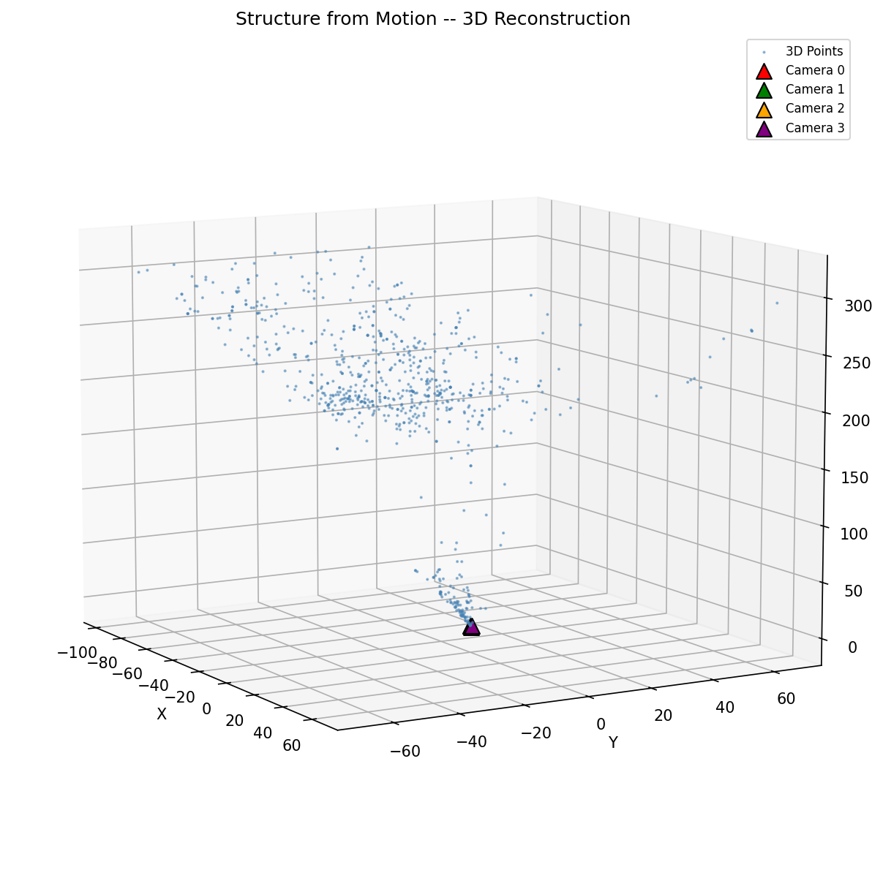
</p>
<p align="center"><em>Reconstructed 3D point cloud from three different viewing angles. Camera positions shown as coloured markers.</em></p>

#### Boundary Estimation (Top-Down Convex Hull)

<p align="center">
  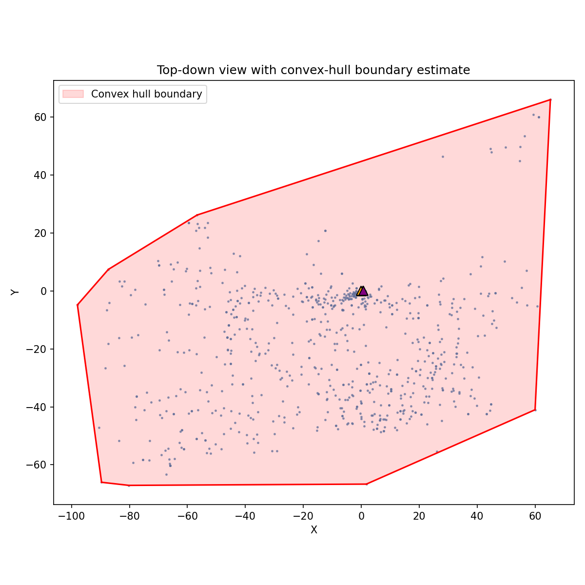
</p>
<p align="center"><em>Top-down projection of the 3D point cloud with convex hull boundary estimate of the planar object.</em></p>

---

## Output Files

### Part 1 — Optical Flow (`output/optical_flow/`)

| File | Description |
|------|-------------|
| `video*_dense_flow.mp4` | Dense Farnebäck flow (HSV colour-coded) |
| `video*_sparse_flow.mp4` | Lucas-Kanade tracked feature points |
| `video*_arrows_flow.mp4` | Flow arrows overlaid on frames |
| `video*_combined_flow.mp4` | Side-by-side dense + sparse |
| `video*_flow_analysis.png` | Speed, direction, motion mask, divergence, curl |
| `video*_flow_histograms.png` | Magnitude & direction histograms |
| `video*_flow_magnitude.png` | Flow magnitude heatmap |
| `video*_moving_objects.png` | Moving object detection with bounding boxes |
| `video*_bilinear_interp.png` | Bilinear interpolation demonstration |
| `video*_tracking_validation.png` | LK tracking vs ground truth |
| `video*_tracking_validation.txt` | Numerical tracking results (per-point) |
| `video*_tracking_error_hist.png` | Error distribution histogram |
| `video*_bilinear_interp.txt` | Step-by-step interpolation computation |
| `video*_flow_inference.txt` | Motion inference summary |

### Part 2 — SfM (`output/sfm/`)

| File | Description |
|------|-------------|
| `sfm_input_views.png` | Grid of the 4 input images |
| `matches_i_j.png` | Feature matches between view pairs (6 pairs) |
| `sfm_3d_view{1,2,3}.png` | 3D point cloud from different angles |
| `sfm_boundary_topdown.png` | Top-down boundary estimate (convex hull) |
| `points_3d.txt` | Reconstructed 3D point coordinates |
| `camera_poses.txt` | Camera K, R, t, epipolar geometry & DLT workout |

---

## Report

Compile the LaTeX report:

```bash
pdflatex report.tex
```

The report includes:
- Derivation of the optical flow constraint equation
- Lucas-Kanade method derivation from fundamentals
- Bilinear interpolation derivation
- Tracking validation analysis
- Epipolar geometry and essential matrix theory
- Triangulation (DLT) derivation
- SfM pipeline description and results
