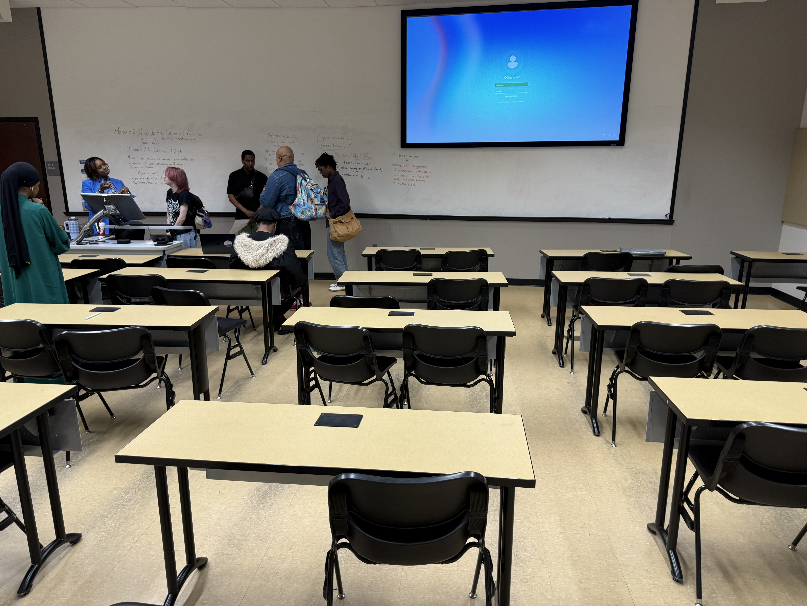
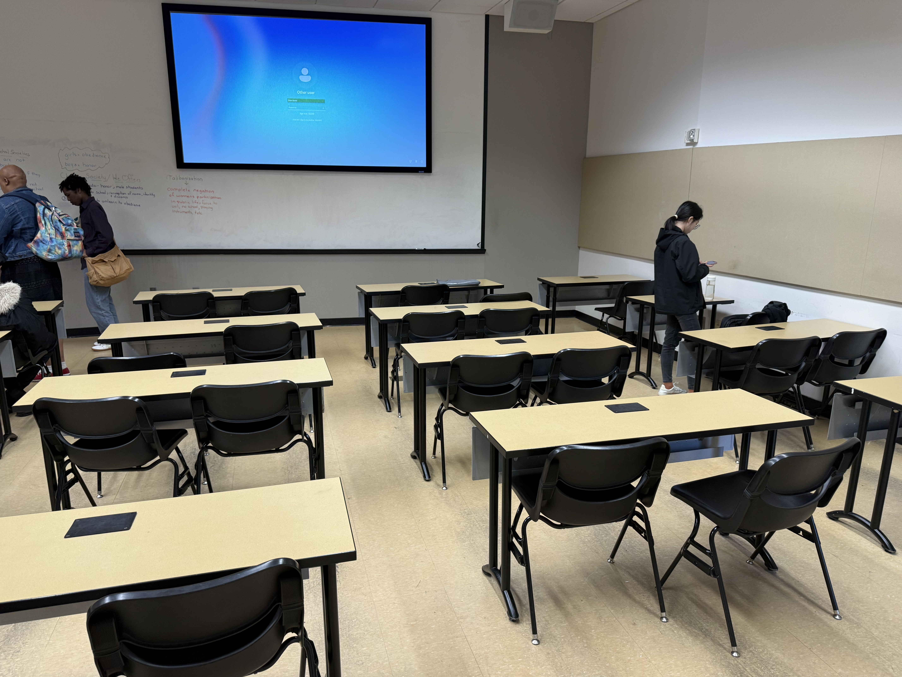

# CSc 8830 — Module 8: Stereo Camera Classroom Localisation

## Assignment

> Using a simple stereo camera setup, compute the locations (2D, parallel to floor) of each table and chair in the classroom. Submit a X-Y 2D plot marking tables in red and chairs as blue and your code file.

## Camera Setup

| Parameter | Value |
|-----------|-------|
| Camera | iPhone 16 Pro Max — 24 mm f/1.78 main lens |
| Resolution | 5712 × 4284 (24 MP) |
| Baseline | ~1.8 m (two handheld shots from left and right positions) |
| Orientation | Landscape, roughly horizontal |

## Stereo Input Images

<p align="center">
  
  
</p>
<p align="center"><em>Left and right stereo images of the classroom captured with iPhone 16 Pro Max.</em></p>

## Approach

### Image-Based 2D Localisation

The stereo pair is used to verify the scene geometry (epipolar analysis, image swap detection) and to detect objects with **YOLOv8x** (extra-large, COCO-pretrained). Since the wide-baseline handheld setup produces unreliable dense depth, the 2D floor-plan positions are derived directly from **where each object appears in the image**:

- **X (lateral)** — horizontal pixel position of the bbox centre, mapped to metres
- **Y (depth)** — vertical pixel position (objects higher in the image are farther from the camera)

This perspective-projection mapping preserves the spatial layout of the classroom as observed by the camera without relying on noisy stereo depth estimates.

### Pipeline

```
left.jpeg + right.jpeg (5712×4284 iPhone 16 Pro Max stereo pair)
  ├── Resize to ≤ 1600 px wide (scale 0.280)
  ├── SIFT matching → Fundamental matrix → stereoRectifyUncalibrated
  ├── Auto-swap if images are in wrong L/R order (detected via median shift)
  ├── Classify baseline: wide (>25% of width) → 469 px median disparity
  ├── YOLOv8x detection on original left image
  │     ├── Model: yolov8x.pt (extra-large, 68.2M params)
  │     ├── Inference size: 1280 px
  │     └── Confidence threshold: 0.15
  ├── Same-class IoU NMS (threshold 0.35) to remove duplicate bboxes
  ├── Image-based positioning:
  │     ├── X = (u_norm − 0.5) × room_width
  │     └── Y = (1 − v_norm) × room_depth
  └── Plot 2D floor plan (tables = red ■, chairs = blue ●)
```

## Usage

```bash
conda activate computer_vision_env

# Run on classroom stereo pair
python stereo_localization.py \
    --left images/left.jpeg --right images/right.jpeg \
    --outdir output_real --baseline 1.8
```

## Results

The pipeline detected **12 tables** and **22 chairs** spread across the classroom.

### 2D Classroom Layout

<p align="center">
  
</p>
<p align="center"><em>2D X-Y plot of detected tables (red ■) and chairs (blue ●). Camera is at the origin (black triangle).</em></p>

### Detections on Left Image

<p align="center">
  
</p>
<p align="center"><em>YOLOv8x detections with bounding boxes — tables in red, chairs in blue.</em></p>

### Detection Summary (detections.csv)

| # | Label | X (m) | Y (m) | Confidence |
|---|-------|-------|-------|------------|
| 1 | chair | 0.11 | 1.34 | 0.95 |
| 2 | chair | −1.12 | 4.77 | 0.93 |
| 3 | chair | 0.87 | 4.70 | 0.93 |
| 4 | chair | 5.13 | 4.39 | 0.93 |
| 5 | chair | −3.97 | 5.21 | 0.90 |
| 6 | chair | −5.73 | 4.49 | 0.90 |
| 7 | chair | 6.71 | 1.83 | 0.88 |
| 8 | chair | 1.07 | 6.17 | 0.87 |
| 9 | chair | 5.79 | 6.18 | 0.86 |
| 10 | chair | 4.03 | 5.55 | 0.84 |
| 11 | chair | −5.29 | 6.27 | 0.81 |
| 12 | chair | −0.78 | 6.02 | 0.81 |
| 13 | chair | −0.10 | 6.85 | 0.78 |
| 14 | chair | 4.02 | 6.82 | 0.76 |
| 15 | chair | 1.21 | 6.84 | 0.76 |
| 16 | table | 5.73 | 4.67 | 0.75 |
| 17 | table | −5.83 | 5.04 | 0.74 |
| 18 | chair | 7.07 | 5.00 | 0.73 |
| 19 | table | −7.17 | 2.33 | 0.71 |
| 20 | chair | −4.22 | 6.81 | 0.68 |
| 21 | table | 6.40 | 2.56 | 0.67 |
| 22 | chair | 5.76 | 6.67 | 0.67 |
| 23 | table | −1.62 | 2.05 | 0.62 |
| 24 | table | −0.11 | 5.66 | 0.48 |
| 25 | table | −4.13 | 5.74 | 0.44 |
| 26 | chair | −6.05 | 6.71 | 0.44 |
| 27 | table | 4.84 | 5.68 | 0.43 |
| 28 | chair | −7.34 | 4.44 | 0.38 |
| 29 | chair | 7.89 | 6.09 | 0.38 |
| 30 | table | 0.40 | 6.24 | 0.35 |
| 31 | table | 0.50 | 6.90 | 0.32 |
| 32 | table | −0.10 | 4.89 | 0.26 |
| 33 | table | 7.23 | 6.46 | 0.22 |
| 34 | chair | −5.39 | 7.43 | 0.17 |

## Output Files

| File | Description |
|------|-------------|
| `output_real/classroom_layout_2d.png` | **2D X-Y floor-plan plot** (tables = red ■, chairs = blue ●) |
| `output_real/detections_left.png` | Left image with annotated bounding boxes |
| `output_real/detections.csv` | Per-object: label, floor X, floor Y, depth, confidence |

## Requirements

```
opencv-python>=4.8
numpy
matplotlib
scipy
ultralytics   # YOLOv8 object detection
```

Install: `pip install ultralytics scipy` (auto-downloads YOLOv8x model on first run).
