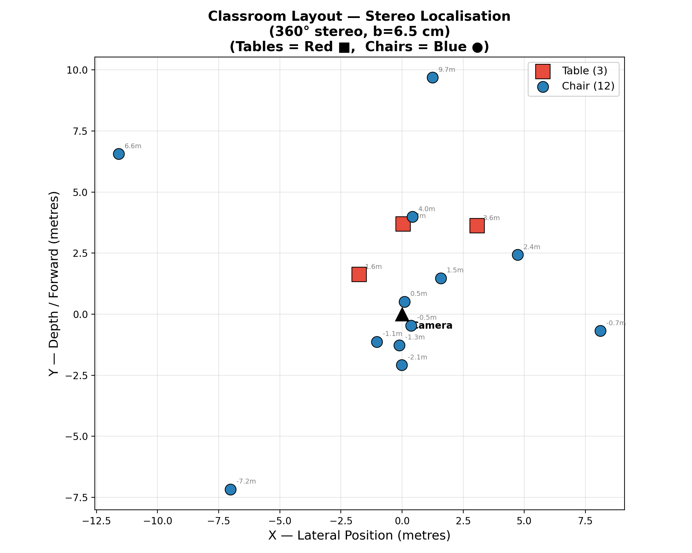
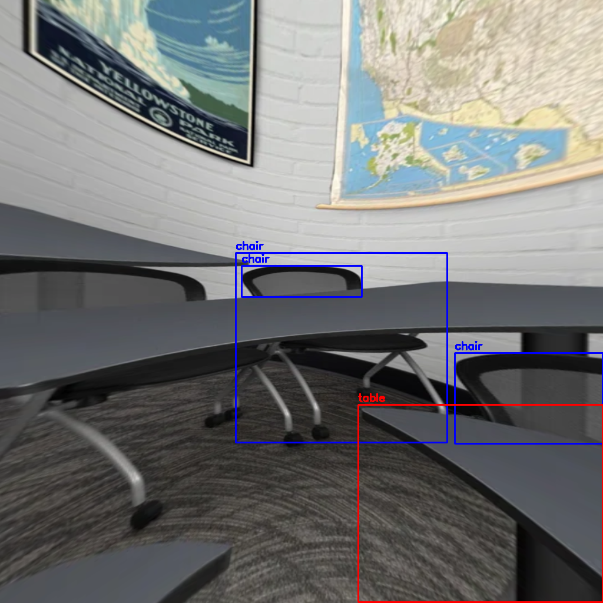
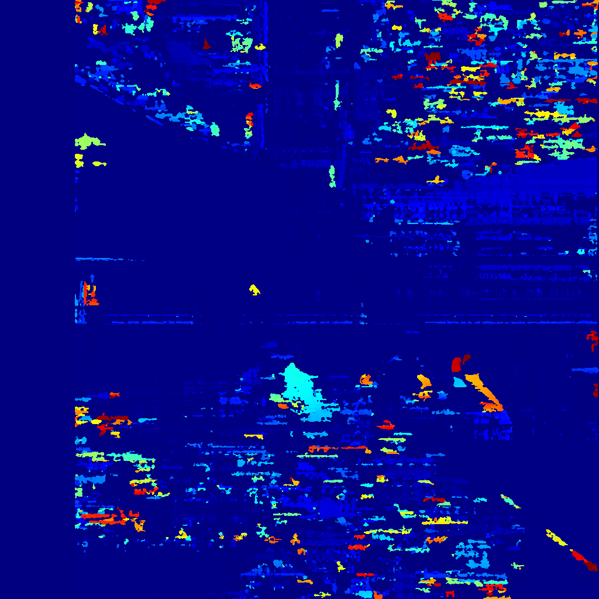

# CSc 8830 — Module 8: Stereo Camera Classroom Localisation

## Assignment

> Using a simple stereo camera setup, compute the locations (2D, parallel to floor) of each table and chair in the classroom. Submit a X-Y 2D plot marking tables in red and chairs as blue and your code file.

## Approach

### Stereo Geometry

A simple stereo camera setup consists of two horizontally aligned cameras separated by a known **baseline** $b$. For a point visible in both images at pixel columns $u_L$ (left) and $u_R$ (right), the **disparity** is:

$$d = u_L - u_R$$

The **depth** (distance from the camera) is then:

$$Z = \frac{f \cdot b}{d}$$

where $f$ is the focal length in pixels. The lateral position is:

$$X = \frac{(u - c_x) \cdot Z}{f}$$

This gives us the 2D floor-plan coordinates $(X, Y)$ where $X$ is lateral and $Y = Z$ is depth.

### 360° Equirectangular Stereo Handling

The input image is a **side-by-side equirectangular stereo pair** (4096 × 2048, each eye 2048 × 2048). Standard stereo matching and object detection cannot be applied directly to equirectangular projections because:

- **Straight lines are curved** → YOLO detection accuracy drops significantly
- **Stereo geometry assumes perspective projection** → disparity-to-depth formulas break down

The pipeline automatically detects equirectangular format (square per-eye aspect ratio) and activates a **multi-view 360° scanning** strategy:

1. **Perspective extraction** — For each yaw angle (0°, 30°, 60°, …, 330°), extract a perspective view from both left and right equirectangular images using the gnomonic projection with configurable FoV (default 110°).
2. **Object detection** — YOLOv8 (COCO-pretrained) detects `chair` and `dining table` in each perspective view.
3. **Stereo disparity** — SGBM computes a dense disparity map for each perspective view pair.
4. **Depth estimation** — Median disparity in the central 60% of each bounding box is converted to depth.
5. **World-coordinate transform** — Each detection's camera-frame position is rotated back by the yaw angle to produce unified world-frame $(X, Y)$ coordinates.
6. **Non-Maximum Suppression** — Detections from overlapping views within 0.8 m of each other (same class) are merged, keeping the highest-confidence one.
7. **Plotting** — Tables plotted as **red squares**, chairs as **blue circles** on a 2D X-Y floor plan.

### Pipeline Summary

```
image.png (SBS equirect 4096×2048)
  ├── Split → left (2048×2048) + right (2048×2048)
  ├── For each yaw in [0°, 30°, ..., 330°]:
  │     ├── equirect → perspective (gnomonic, FoV=110°)
  │     ├── YOLOv8 detection (chairs, tables)
  │     ├── SGBM stereo disparity
  │     ├── Disparity → depth → camera-frame (X, Z)
  │     └── Rotate by yaw → world-frame (X_w, Z_w)
  ├── Merge all detections (NMS, d < 0.8 m)
  └── Plot 2D floor plan
```

## Usage

```bash
conda activate computer_vision_env

# With a side-by-side stereo image (auto-detects 360° equirectangular):
python stereo_localization.py --stereo image.png --outdir output

# With separate left/right perspective images:
python stereo_localization.py --left images/left.jpg --right images/right.jpg

# Demo mode (synthetic classroom, no images needed):
python stereo_localization.py --demo

# Custom parameters:
python stereo_localization.py --stereo image.png --fov 110 --yaw-step 30 --baseline 0.065
```

## Output

| File | Description |
|------|-------------|
| `output/classroom_layout_2d.png` | **2D X-Y floor-plan plot** (tables = red ■, chairs = blue ●) |
| `output/detections_left.png` | Best perspective view with annotated bounding boxes |
| `output/disparity_map.png` | Stereo disparity map (colour-coded) for best view |
| `output/detections.csv` | Per-object: label, floor X, floor Y, depth, confidence |
| `output/yaw_scans/` | Individual perspective views extracted at each yaw angle |

## Requirements

```
opencv-python>=4.8
numpy
matplotlib
ultralytics   # YOLOv8 object detection
```

Install: `pip install ultralytics` (auto-downloads YOLOv8 nano model on first run).

## Results

The pipeline detected **3 tables** and **12 chairs** across 12 perspective views (yaw 0°–330° in 30° steps), merged via world-coordinate NMS.

### 2D Classroom Layout

<p align="center">
  
</p>
<p align="center"><em>2D X-Y plot of detected tables (red ■) and chairs (blue ●). Camera is at the origin (black triangle).</em></p>

### Detections on Best Perspective View

<p align="center">
  
</p>
<p align="center"><em>Annotated perspective extraction (yaw with most detections) showing YOLO bounding boxes.</em></p>

### Disparity Map

<p align="center">
  
</p>
<p align="center"><em>SGBM stereo disparity map for the best perspective view pair. Warmer colours = closer objects.</em></p>
