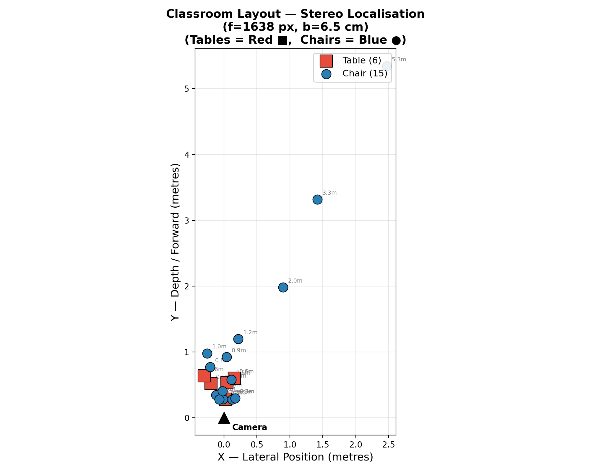
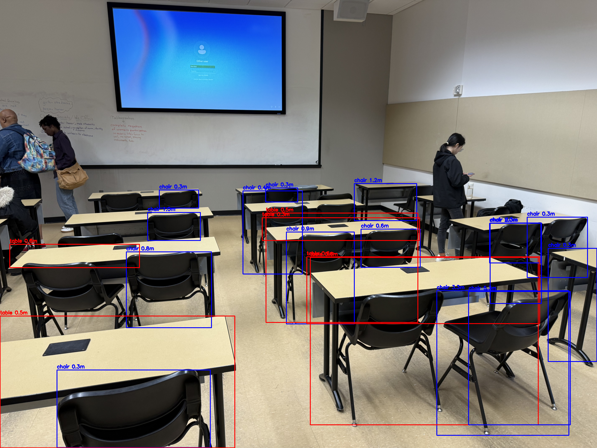
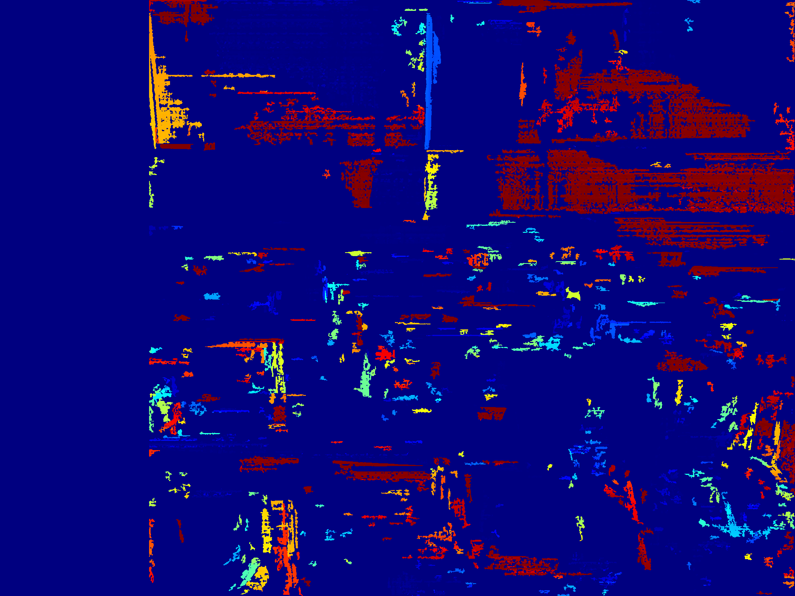

# CSc 8830 — Module 8: Stereo Camera Classroom Localisation

## Assignment

> Using a simple stereo camera setup, compute the locations (2D, parallel to floor) of each table and chair in the classroom. Submit a X-Y 2D plot marking tables in red and chairs as blue and your code file.

## Approach

### Stereo Geometry

A simple stereo camera setup consists of two horizontally aligned cameras separated by a known **baseline** $b$. For a point visible in both images at pixel columns $u_L$ (left) and $u_R$ (right), the **disparity** is:

$$d = u_L - u_R$$

The **depth** (distance from the camera) is then:

$$Z = \frac{f \cdot b}{d}$$

where $f$ is the focal length in pixels. The lateral position is:

$$X = \frac{(u - c_x) \cdot Z}{f}$$

This gives us the 2D floor-plan coordinates $(X, Y)$ where $X$ is lateral and $Y = Z$ is depth.

### Pipeline

1. **Object detection** — YOLOv8 (COCO-pretrained, nano model) detects `chair` and `dining table` classes in the left image.
2. **Stereo disparity** — Semi-Global Block Matching (SGBM) computes a dense disparity map from the stereo pair. `numDisparities` is auto-scaled to image width.
3. **Depth estimation** — For each detected bounding box, the median disparity in the central 60% of the box is converted to depth using $Z = fb/d$.
4. **Depth filtering** — Detections beyond a configurable max depth (default 20 m) are discarded as outliers.
5. **2D localisation** — Depth + lateral offset gives $(X, Y)$ floor coordinates for every object.
6. **Plotting** — Tables plotted as **red squares ■**, chairs as **blue circles ●** on a 2D X-Y floor plan.

The script also supports **360° equirectangular stereo images** (auto-detected). In that mode, it extracts overlapping perspective views at multiple yaw angles, detects/localises in each, transforms to world coordinates, and merges via NMS.

### Pipeline Summary

```
left.jpeg + right.jpeg (perspective stereo pair)
  ├── [Optional] Resize to ≤ 2048 px (for tractable SGBM)
  ├── YOLOv8 detection (chairs, tables)
  ├── SGBM stereo disparity
  ├── For each detection:
  │     ├── Median disparity in bbox centre
  │     ├── Depth Z = f·b / d
  │     ├── Lateral X = (u − cx) · Z / f
  │     └── Filter if depth > max_depth
  └── Plot 2D floor plan (X vs Y)
```

## Usage

```bash
conda activate computer_vision_env

# With real stereo images (primary):
python stereo_localization.py --left images/left.jpeg --right images/right.jpeg --outdir output_real

# With a side-by-side stereo image (auto-detects 360° equirectangular):
python stereo_localization.py --stereo image.png --outdir output

# Demo mode (synthetic classroom, no images needed):
python stereo_localization.py --demo

# Custom parameters:
python stereo_localization.py --left l.jpg --right r.jpg --baseline 0.10 --max-depth 15
```

## Output

| File | Description |
|------|-------------|
| `output_real/classroom_layout_2d.png` | **2D X-Y floor-plan plot** (tables = red ■, chairs = blue ●) |
| `output_real/detections_left.png` | Left image with annotated bounding boxes |
| `output_real/disparity_map.png` | Stereo disparity map (colour-coded) |
| `output_real/detections.csv` | Per-object: label, floor X, floor Y, depth, confidence |

## Requirements

```
opencv-python>=4.8
numpy
matplotlib
ultralytics   # YOLOv8 object detection
```

Install: `pip install ultralytics` (auto-downloads YOLOv8 nano model on first run).

## Results

The pipeline was run on a real stereo pair taken in the classroom (`images/left.jpeg`, `images/right.jpeg`). It detected **6 tables** and **15 chairs** (2 outlier detections filtered at > 20 m).

### 2D Classroom Layout

<p align="center">
  
</p>
<p align="center"><em>2D X-Y plot of detected tables (red ■) and chairs (blue ●). Camera is at the origin (black triangle).</em></p>

### Detections on Left Image

<p align="center">
  
</p>
<p align="center"><em>YOLOv8 detections with bounding boxes — tables in red, chairs in blue, with estimated depth labels.</em></p>

### Disparity Map

<p align="center">
  
</p>
<p align="center"><em>SGBM stereo disparity map. Warmer colours = closer objects (higher disparity).</em></p>
