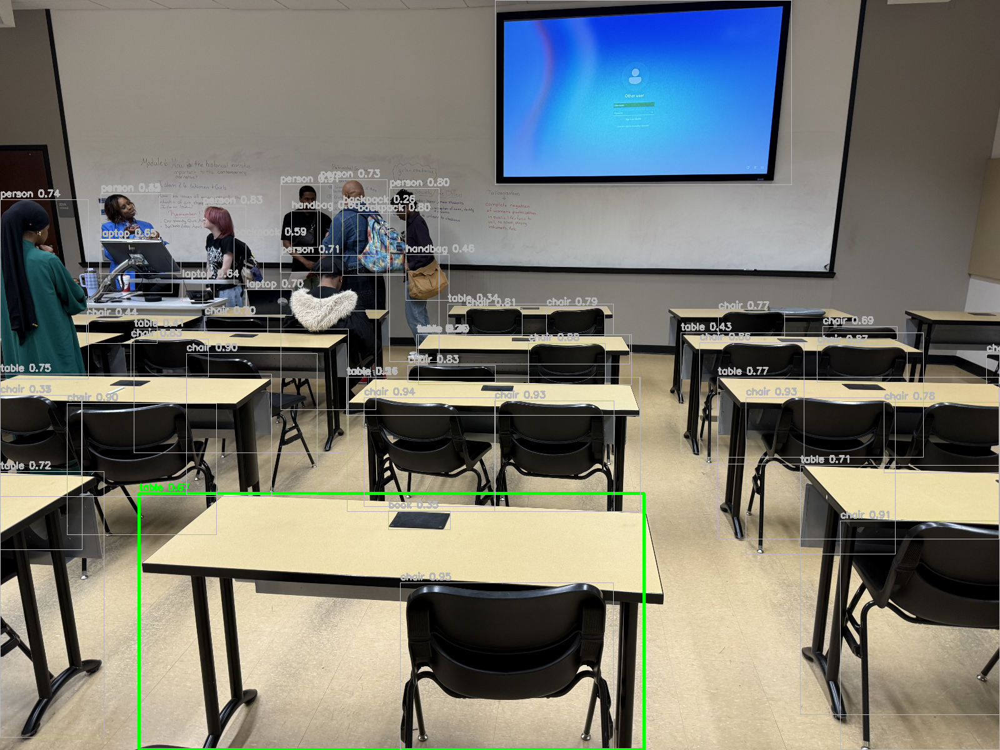
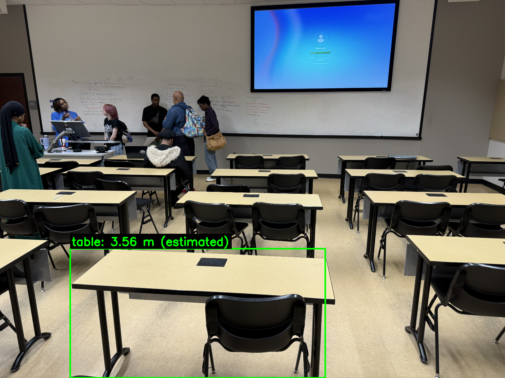

# CSc 8830 — Module 9: Uncalibrated Stereo Distance Estimation

## Assignment

> Use an uncalibrated stereo setup to observe an object in the classroom.
> Select an object of interest and estimate its distance from the camera setup.
> Your report must include the computation and presentation of the Rotation Matrix (R), Essential Matrix (E), and Fundamental Matrix (F).
> Include an image of your setup and annotate the selected object, the estimated distance, and the ground truth distance.

## Camera Setup

| Parameter | Value |
|-----------|-------|
| Camera | iPhone 16 Pro Max — 24 mm f/1.78 main lens |
| Resolution | 5712 × 4284 (24 MP) |
| Baseline | ~1.5 m (two handheld shots from left and right positions) |
| Focal length | 3808 px (at full resolution) |

## Stereo Input Images

<p align="center">
  
  
</p>
<p align="center"><em>Left and right stereo images of the classroom.</em></p>

## Approach

### Pipeline

1. **Feature Matching** — SIFT features detected and matched with Lowe's ratio test. Images auto-swapped if needed for positive disparity.
2. **Fundamental Matrix (F)** — Computed via 8-point algorithm + RANSAC. Verified by epipolar constraint: $\mathbf{x'}^\top \mathbf{F} \mathbf{x} \approx 0$.
3. **Essential Matrix (E)** — Derived from F and camera intrinsics: $\mathbf{E} = \mathbf{K}^\top \mathbf{F} \mathbf{K}$. Rank-2 constraint enforced via SVD.
4. **Pose Recovery (R, t)** — E decomposed into rotation R and translation t with chirality check.
5. **Distance Estimation** — Using disparity of matched feature points within the object's bounding box: $Z = \frac{f \cdot b}{d}$.
6. **Object Detection** — YOLOv8x auto-detects the object of interest.

## Usage

```bash
conda activate computer_vision_env

python uncalibrated_stereo.py \
    --left images/left.jpeg --right images/right.jpeg \
    --baseline 1.5 \
    --ground-truth 3.5 \
    --outdir output
```

### CLI Options

| Flag | Description |
|------|-------------|
| `--left` | Left stereo image path |
| `--right` | Right stereo image path |
| `--baseline` | Camera separation in metres |
| `--ground-truth` | (Optional) Known distance to object for error computation |
| `--object` | (Optional) Object label to select (e.g. `table`, `chair`) |
| `--outdir` | Output directory (default: `output`) |

## Results

### Computed Matrices

**Fundamental Matrix F:**
```
⎡  2.564e-07  -4.054e-06   1.926e-03 ⎤
⎢  3.381e-06   2.931e-07  -5.330e-03 ⎥
⎣ -2.131e-03   3.943e-03   1.000e+00 ⎦
```

**Essential Matrix E:**
```
⎡  0.2691  -4.5868  -0.3059 ⎤
⎢  3.8690   0.3620  -2.6276 ⎥
⎣  0.1154   0.9297  -0.0539 ⎦
```

**Rotation Matrix R:**
```
⎡  0.9184   0.0797  -0.3875 ⎤
⎢ -0.0755   0.9968   0.0262 ⎥
⎣  0.3884   0.0052   0.9215 ⎦
```

**Translation vector t:** `[-0.1952, 0.0428, -0.9798]ᵀ`

- Rotation angle: 23.32°
- det(R) = 1.000000 ✓
- E singular values: [4.6952, 4.6952, 0.0000] (σ₁ ≈ σ₂, σ₃ ≈ 0 ✓)

### Distance Estimation

| Quantity | Value |
|----------|-------|
| Selected object | table |
| Matched points used | 47 |
| Median disparity | 450.0 px |
| **Estimated distance** | **3.56 m** |

### All Detections

<p align="center">
  
</p>
<p align="center"><em>All detections in the image.</em></p>

### Annotated Object

<p align="center">
  
</p>
<p align="center"><em>Selected object (table) with estimated distance annotation.</em></p>

### Feature Matches

<p align="center">
  
</p>
<p align="center"><em>SIFT feature matches between left and right images (265 RANSAC inliers).</em></p>

### Epipolar Lines

<p align="center">
  
</p>
<p align="center"><em>Epipolar lines verifying the Fundamental Matrix — corresponding points lie on or near their epipolar lines.</em></p>

### Summary

<p align="center">
  
</p>

## Requirements

```
opencv-python>=4.8
numpy
matplotlib
ultralytics   # YOLOv8 object detection
```
